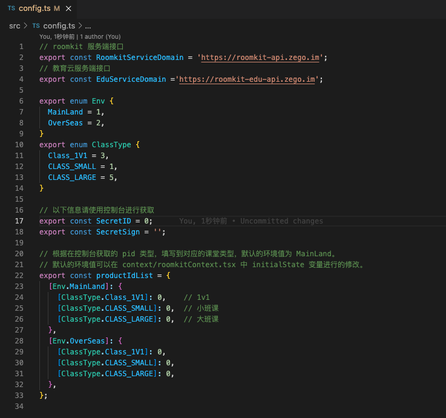
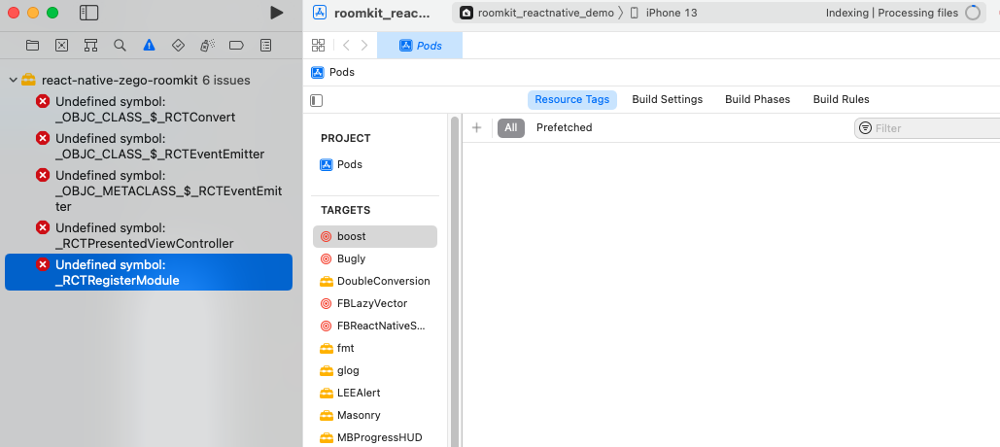

## 示例源码运行指引

### 1 准备环境

在开始集成 SDK 前，请确保开发环境满足以下技术要求：

- React Native 0.60 或以上版本。
- iOS 9.0 或以上版本且支持音视频的 iOS 设备或模拟器（推荐使用真机）。
- Android 版本不低于 4.4 且支持音视频的 Android 设备或模拟器（推荐使用真机），如果为真机，请开启“允许调试”选项。
- iOS/Android 设备已经连接到 Internet。
- 安装 [Node.js](https://nodejs.org/en/) 14.0 或者以上，推荐使用其官网首页展示的长期支持版。

### 2 前提条件

已在 [RoomKit 管理后台](https://roomkit.zego.im/console) 创建项目，并获取初始化 RoomKit SDK 所必须的 SecretID、SecretSign、ProductID 等信息，详见 [开通 RoomKit 服务](https://doc-preview-zh.zego.im/article/16383)。


### 3. 示例源码目录结构

```
roomkit-reactnative-demo
├── android
├── ...
├── ios
├── src
│   ├── App.tsx
│   ├── api
│   │   ├── requestApi.ts      // 请求封装层
│   │   └── roomkitApi.ts      // roomkit api 
│   ├── assets
│   │   ├── image
│   │   └── translations       // 国际化
│   │       ├── en.json
│   │       └── zh.json
│   ├── components
│   │   └── NavigationHeader.tsx
│   ├── config.ts              // roomkit 配置
│   ├── context
│   │   └── roomkitContext.tsx // demo 状态管理
│   ├── pages
│   │   ├── Login
│   │   │   ├── components
│   │   │   │   └── index.tsx  // Login 的页面组件
│   │   │   └── index.tsx      // 页面代码
│   │   ├── ...
│   │   └── Setting
│   │       ├── components
│   │       │   └── index.tsx
│   │       └── index.tsx
│   ├── types                 // 类型文件
│   │   └── types.ts
│   └── utils                 // 工具函数与自定义toast
│       ├── CustomToast.tsx
│       └── utils.ts
├── package.json
├── tsconfig.json
└── yarn.lock
```


### 4 运行示例代码

#### 4.1 填写配置文件

在  /src/config.ts 文件中，填入在控制台获取的 SecretID 、SecretSign、pid




#### 4.2 运行项目

完成配置后，进入工程根目录并输入：

`yarn`

下一步，在运行 **iOS** 之前，你还需要 `cd` 到 `ios` 目录下，执行以下命令：

`pod install`

现在，`cd` 返回到上级页面，执行以下命令：

`yarn start`

然后，再执行以下命令可以在对应的设备进行调试：

`yarn ios` or `yarn android`


## 常见问题

1. `yarn ios` 失败，可以通过启动 `/ios/roomkit_reactnative_demo.xcworkspace` 文件，在 xcode 中启动模拟器，查看详细报错。


2. 如果您在编译 IOS 项目时，出现 Undefined symbol 问题，应该如何解决？

问题如图所示：




使用 Xcode 打开 "您的项目/iOS/${yourProjectName}.xcworkspace"，在界面单击点开 Pods，执行对应的操作：


